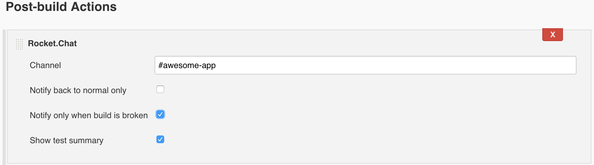

# Rocket.Chat plugin for Jenkins

A plugin to notify Jenkins build statuses on Rocket.Chat.

| Branch   |      Status                                                                                                                                |
|----------|:------------------------------------------------------------------------------------------------------------------------------------------:|
| master |   |
| develop|  |

## Setup

### On Rocket.Chat

* Create a new incoming webhook **Administration > Integrations > Incoming WebHook**

### On Jenkins

* Install the plugin with *.hpi* file in **Manage Jenkins > Manage Plugins > Advanced tab > Upload Plugin**
* Then in **Manage Jenkins > Configure System**, go the the **Rocket.Chat** section an set the *Webhook URL* for the incoming webhook created earlier.

## Usage

To enable Rocket.Chat notifications on a job:

* In the **Post-build Actions** section, add **Rocket.Chat** and configure destination channel and options

Parameters are:

* **Channel**: one or more destination channels separated by a space and starting with a #.
* **Notify back to normal only**: if enabled, notification will be sent only be sent when the job failed, or went back to normal (right after a failure).
* **Show test summary**: if enabled, and tests are configured on the job, will display test summary on the notification.

